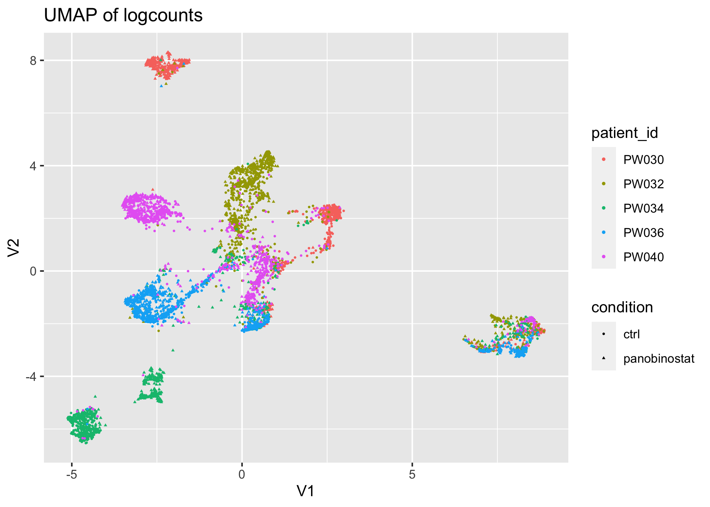
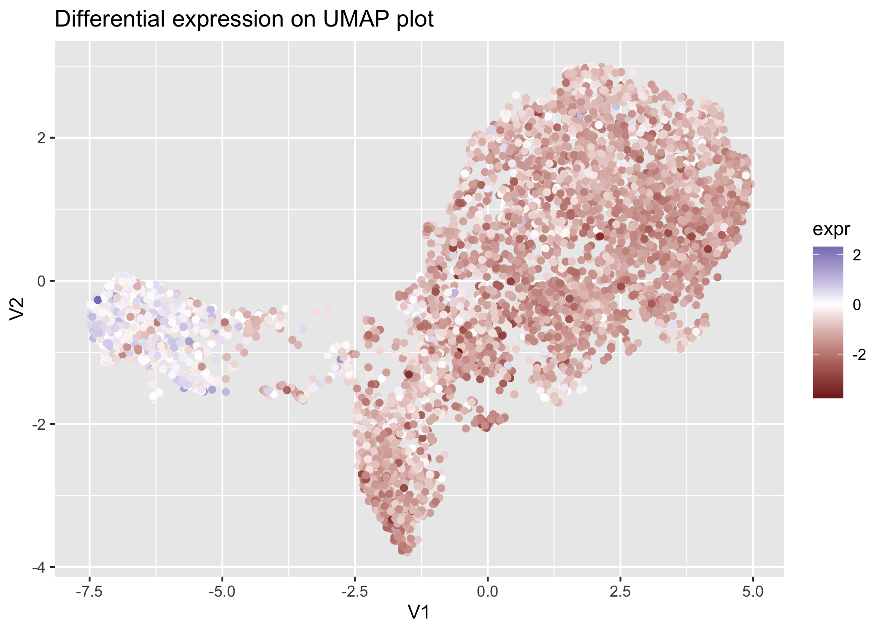
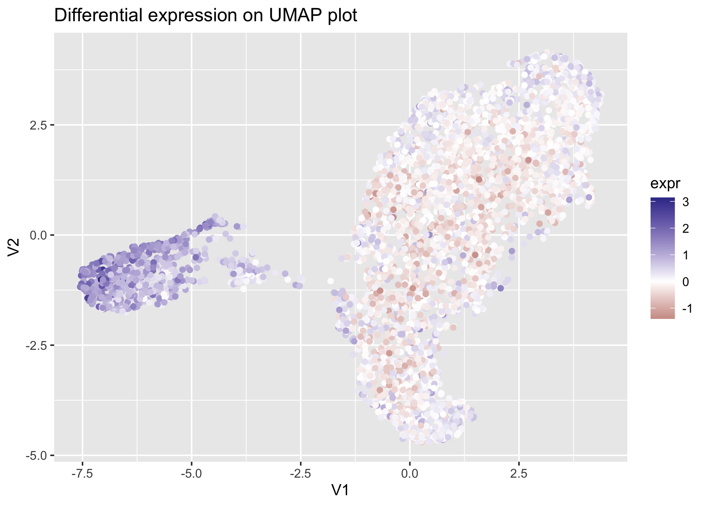
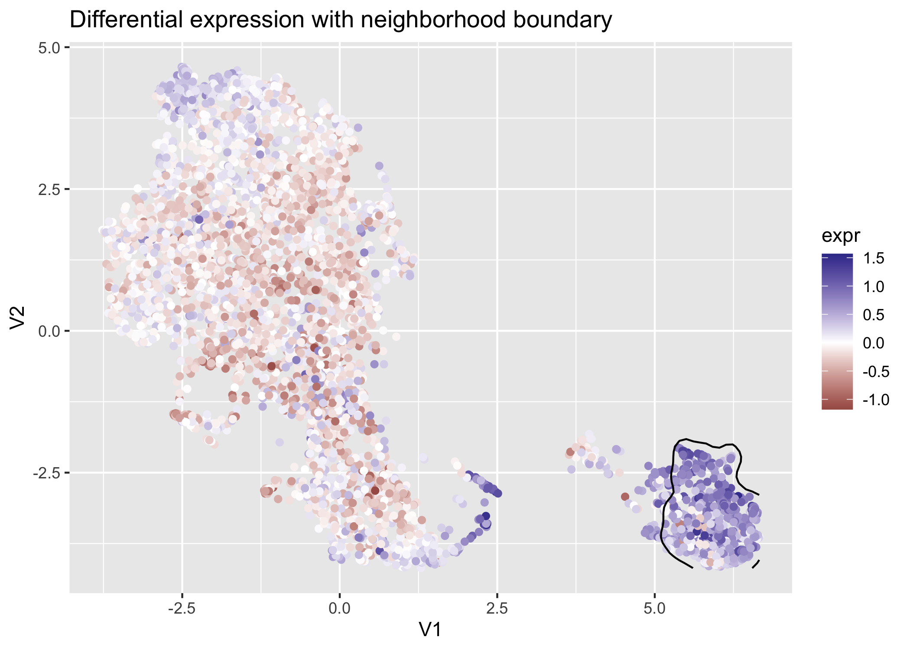
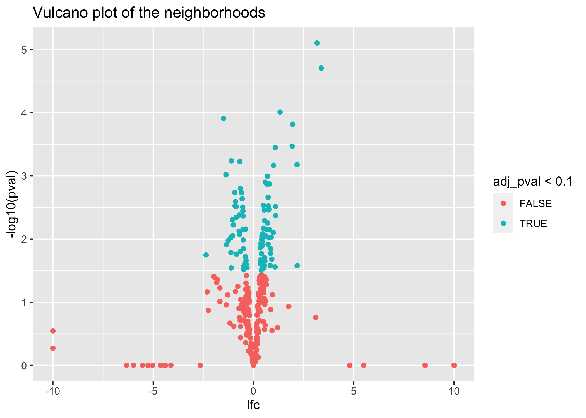
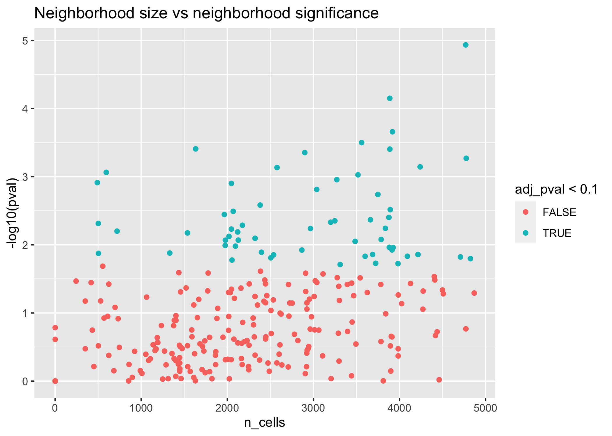

<!-- README.md is generated from README.Rmd. Please edit that file -->

# Latent Embedding Multivariate Regression (LEMUR)

<!-- badges: start -->
<!-- badges: end -->

The goal of lemur is to enable easy analysis of multi-condition
single-cell data. Lemur fits latent embedding regression, which means
that it tries to find the PCA embedding for each condition and
parameterizes the transition from one embedding to the other. For this
task, lemur uses geodesic regression on the Grassmann manifold, which is
solved efficiently using tangent-space linear modelling. The result is
an interpretable model of the gene expression for arbitrary experimental
designs that can be expressed using a design matrix.

## Installation

Lemur depends on features from
[`glmGamPoi`](https://github.com/const-ae/glmGamPoi) which are only
available in the development version, so please install `glmGamPoi` from
Github before proceeding with lemur’s installation:

``` r
devtools::install_github("const-ae/glmGamPoi")
```

You can install the released version of lemur from Github

``` r
devtools::install_github("const-ae/lemur")
```

## A word of caution

This package is being actively developed and I am still making breaking
changes. I am delighted if you decide to try out the package and please
open an issue if you think you found a bug, have an idea for a cool
feature, or any question about how LEMUR works. Consider this a *beta*
release with the goal to gather feedback but be aware that code written
against the current version of lemur might not work in the future.

## Quickstart

``` r
library(lemur)
library(SingleCellExperiment)

fit <- lemur(sce, design = ~ patient_id + condition, n_embedding = 15)
fit <- align_harmony(fit)   # This step is optional
fit <- test_de(fit, contrast = cond(condition = "ctrl") - cond(condition = "panobinostat"))
nei <- find_de_neighborhoods(fit, counts = counts(sce), group_by = vars(patient_id, condition))
```

## Example

We will demonstrate `lemur` using a dataset by Zhao et al. (2021). The
data consists of tumor biopsies from five glioblastomas which were
treated using panobinostat or used as a control. Accordingly there are
ten samples (patient-treatment combinations) which we will analyze using
a paired experimental design.

We start by loading some packages which are necessary to analyze the
data:

``` r
library(tidyverse)
library(SingleCellExperiment)
library(lemur)
set.seed(1)
```

We use a reduced-size version of the glioblastoma data that ships with
the `lemur` package.

``` r
lemur::glioblastoma_example_data
#> class: SingleCellExperiment 
#> dim: 300 5000 
#> metadata(0):
#> assays(2): counts logcounts
#> rownames(300): ENSG00000210082 ENSG00000118785 ... ENSG00000167468
#>   ENSG00000139289
#> rowData names(6): gene_id symbol ... strand. source
#> colnames(5000): CGCCAGAGCGCA AGCTTTACTGCG ... TGAACAGTGCGT TGACCGGAATGC
#> colData names(10): patient_id treatment_id ... sample_id id
#> reducedDimNames(0):
#> mainExpName: NULL
#> altExpNames(0):
```

Initially, the data separates by the known covariates `patient_id` and
`condition`.

``` r
orig_umap <- uwot::umap(as.matrix(t(logcounts(glioblastoma_example_data))))

as_tibble(orig_umap) %>%
  bind_cols(as_tibble(colData(glioblastoma_example_data))) %>%
  ggplot(aes(x = V1, y = V2)) +
    geom_point(aes(color = patient_id, shape = condition), size = 0.5) +
    labs(title = "UMAP of logcounts")
#> Warning: The `x` argument of `as_tibble.matrix()` must have unique column names if
#> `.name_repair` is omitted as of tibble 2.0.0.
#> ℹ Using compatibility `.name_repair`.
```



We fit the LEMUR model by calling `lemur()`. We provide the experimental
design using a formula. The elements of the formula can refer to columns
of the `colData` of the `SingleCellExperiment` object. We also set the
number of latent dimensions which has a similar interpretation as the
number of dimensions in PCA. Optionally, we can further align
corresponding cells either using manually annotated cell types
(`align_by_grouping`) or an automated alignment procedure (e.g.,
`align_harmony`, `align_neighbors`).

``` r
fit <- lemur(glioblastoma_example_data, design = ~ patient_id + condition, n_embedding = 15, verbose = FALSE)

# We can regularize the alignment either using ridge regression
# or by allowing only rotations or stretching
fit <- align_harmony(fit, stretching = FALSE)
#> Select cells that are considered close with 'harmony'

fit
#> class: lemur_fit 
#> dim: 300 5000 
#> metadata(12): n_ambient n_embedding ... alignment_design
#>   alignment_design_matrix
#> assays(1): expr
#> rownames(300): ENSG00000210082 ENSG00000118785 ... ENSG00000167468
#>   ENSG00000139289
#> rowData names(6): gene_id symbol ... strand. source
#> colnames(5000): CGCCAGAGCGCA AGCTTTACTGCG ... TGAACAGTGCGT TGACCGGAATGC
#> colData names(10): patient_id treatment_id ... sample_id id
#> reducedDimNames(2): linearFit embedding
#> mainExpName: NULL
#> altExpNames(0):
```

The `lemur()` function returns an object that extends
`SingleCellExperiment` and thus supports subsetting and all the familiar
data acessor methods (e.g., `nrow`, `assay`, `colData`, `rowData`). In
addition, `lemur` overloads the `$` operator to allow easy access to
additional fields that are produced by the LEMUR model. For example the
low-dimensional embedding can be accessed using `fit$embedding`:

``` r
umap <- uwot::umap(t(fit$embedding))

as_tibble(umap) %>%
  bind_cols(as_tibble(fit$colData)) %>%
  ggplot(aes(x = V1, y = V2)) +
    geom_point(aes(color = patient_id, shape = condition), size = 0.5) +
    labs(title = "UMAP of latent space from LEMUR")
```


The `test_de` function takes a `lemur_fit_obj` and returns with a new
assay `"DE"` with the predicted difference between two conditions
specified in the `contrast`. Note that `lemur` implements a special
notation for contrasts. Instead of providing a contrast vector or design
matrix column names, you provide for each *condition* the levels and
`lemur` automatically forms the contrast vector. This makes the contrast
more readable.

``` r
fit <- test_de(fit, contrast = cond(condition = "panobinostat") - cond(condition = "ctrl"))
```

We can pick any gene and show the differential expression pattern on the
UMAP plot:

``` r
# EEF1A1
gene_sel <- "ENSG00000156508"

as_tibble(umap) %>%
  mutate(expr = assay(fit, "DE")[gene_sel,]) %>%
  ggplot(aes(x = V1, y = V2)) +
    geom_point(aes(color = expr)) +
    scale_color_gradient2() +
    labs(title = "Differential expression on UMAP plot")
```



Alternatively, we can use the matrix of differential expression values
(`assay(fit, "DE")`) to guide the selection of cell neighborhoods that
show consistent differential expression. If we provide a count matrix,
the function uses a pseudobulked differential expression test to confirm
the gene expression differences on the count level.

``` r
neighborhoods <- find_de_neighborhoods(fit, counts = counts(glioblastoma_example_data),
                                      group_by = vars(patient_id, condition),
                                      include_complement = FALSE, verbose = FALSE)
#> dimnames(.) <- NULL translated to
#> dimnames(.) <- list(NULL,NULL)
as_tibble(neighborhoods) %>%
  arrange(pval) %>%
  left_join(as_tibble(rowData(fit)), by = c("name" = "gene_id"))
#> # A tibble: 300 × 16
#>    name        region indices n_cells   mean    pval adj_p…¹ f_sta…²   df1   df2
#>    <chr>       <chr>  <I<lis>   <int>  <dbl>   <dbl>   <dbl>   <dbl> <int> <dbl>
#>  1 ENSG000001… 1      <int>      3780  1.32  8.71e-6 0.00261   140.      1  6.80
#>  2 ENSG000001… 1      <int>      3975  2.08  1.40e-4 0.0178     58.6     1  6.80
#>  3 ENSG000001… 1      <int>      3582 -0.538 2.05e-4 0.0178     51.7     1  6.80
#>  4 ENSG000001… 1      <int>      2267 -0.369 2.68e-4 0.0178     47.3     1  6.80
#>  5 ENSG000001… 1      <int>      3850  0.637 3.36e-4 0.0178     43.9     1  6.80
#>  6 ENSG000000… 1      <int>      3150 -0.290 4.16e-4 0.0178     40.9     1  6.80
#>  7 ENSG000001… 1      <int>      2889 -1.49  4.61e-4 0.0178     39.5     1  6.80
#>  8 ENSG000001… 1      <int>      3970  0.596 5.58e-4 0.0178     37.0     1  6.80
#>  9 ENSG000000… 1      <int>      4040 -0.422 6.07e-4 0.0178     36.0     1  6.80
#> 10 ENSG000001… 1      <int>       534  0.641 6.45e-4 0.0178     35.2     1  6.80
#> # … with 290 more rows, 6 more variables: lfc <dbl>, symbol <chr>,
#> #   chromosome <fct>, gene_length <int>, strand. <fct>, source <fct>, and
#> #   abbreviated variable names ¹​adj_pval, ²​f_statistic
```

We can now specifically select regions with significant differential
expression:

``` r
# HLA-DRB1
sel_gene <- "ENSG00000196126"

as_tibble(umap) %>%
  mutate(expr = assay(fit, "DE")[sel_gene,]) %>%
  ggplot(aes(x = V1, y = V2)) +
    geom_point(aes(color = expr)) +
    scale_color_gradient2() +
    labs(title = "Differential expression on UMAP plot")
```



To plot the boundaries of the differential expression neighborhood, we
create a helper dataframe and use the `geom_density2d` function from
`ggplot2`:

``` r
neighborhood_coordinates <- neighborhoods %>%
  filter(name == sel_gene) %>%
  mutate(cell_id = map(indices, \(idx) colnames(fit)[idx])) %>%
  unnest(c(indices, cell_id)) %>%
  left_join(as_tibble(umap, rownames = "cell_id"), by = "cell_id") %>%
  dplyr::select(name, cell_id, V1, V2)

as_tibble(umap) %>%
  mutate(expr = assay(fit, "DE")[sel_gene,]) %>%
  ggplot(aes(x = V1, y = V2)) +
    geom_point(aes(color = expr)) +
    scale_color_gradient2() +
    geom_density2d(data = neighborhood_coordinates, breaks = 0.1, 
                   contour_var = "ndensity", color = "black") +
    labs(title = "Differential expression with neighborhood boundary")
```



To get a better idea of the expression differences across all genes, we
make a vulcano plot of the differential expression results.

``` r
neighborhoods %>%
  ggplot(aes(x = lfc, y = -log10(pval))) +
    geom_point(aes(color  = adj_pval < 0.1)) +
    labs(title = "Vulcano plot of the neighborhoods")
```



``` r
neighborhoods %>%
  ggplot(aes(x = n_cells, y = -log10(pval))) +
    geom_point(aes(color  = adj_pval < 0.1)) +
    labs(title = "Neighborhood size vs neighborhood significance")
```



# Session Info

``` r
sessionInfo()
#> R version 4.2.1 RC (2022-06-17 r82503)
#> Platform: x86_64-apple-darwin17.0 (64-bit)
#> Running under: macOS Big Sur ... 10.16
#> 
#> Matrix products: default
#> BLAS:   /Library/Frameworks/R.framework/Versions/4.2/Resources/lib/libRblas.0.dylib
#> LAPACK: /Library/Frameworks/R.framework/Versions/4.2/Resources/lib/libRlapack.dylib
#> 
#> locale:
#> [1] en_US.UTF-8/en_US.UTF-8/en_US.UTF-8/C/en_US.UTF-8/en_US.UTF-8
#> 
#> attached base packages:
#> [1] stats4    stats     graphics  grDevices utils     datasets  methods  
#> [8] base     
#> 
#> other attached packages:
#>  [1] lubridate_1.9.2             forcats_1.0.0              
#>  [3] stringr_1.5.0               dplyr_1.1.0                
#>  [5] purrr_1.0.1                 readr_2.1.4                
#>  [7] tidyr_1.3.0                 tibble_3.1.8               
#>  [9] ggplot2_3.4.1               tidyverse_2.0.0            
#> [11] SingleCellExperiment_1.20.0 SummarizedExperiment_1.28.0
#> [13] Biobase_2.58.0              GenomicRanges_1.50.2       
#> [15] GenomeInfoDb_1.34.9         IRanges_2.32.0             
#> [17] S4Vectors_0.36.2            BiocGenerics_0.44.0        
#> [19] MatrixGenerics_1.10.0       matrixStats_0.63.0         
#> [21] lemur_0.0.8                
#> 
#> loaded via a namespace (and not attached):
#>  [1] splines_4.2.1             DelayedMatrixStats_1.20.0
#>  [3] expm_0.999-7              highr_0.10               
#>  [5] GenomeInfoDbData_1.2.9    yaml_2.3.7               
#>  [7] pillar_1.8.1              lattice_0.20-45          
#>  [9] glue_1.6.2                digest_0.6.31            
#> [11] XVector_0.38.0            colorspace_2.1-0         
#> [13] cowplot_1.1.1             htmltools_0.5.4          
#> [15] Matrix_1.5-3              pkgconfig_2.0.3          
#> [17] zlibbioc_1.44.0           scales_1.2.1             
#> [19] tzdb_0.3.0                pracma_2.4.2             
#> [21] timechange_0.2.0          generics_0.1.3           
#> [23] farver_2.1.1              ellipsis_0.3.2           
#> [25] withr_2.5.0               harmony_0.1.1            
#> [27] cli_3.6.0                 magrittr_2.0.3           
#> [29] evaluate_0.20             fansi_1.0.4              
#> [31] MASS_7.3-58.2             tools_4.2.1              
#> [33] hms_1.1.2                 lifecycle_1.0.3          
#> [35] munsell_0.5.0             DelayedArray_0.24.0      
#> [37] irlba_2.3.5.1             isoband_0.2.7            
#> [39] compiler_4.2.1            rlang_1.0.6              
#> [41] grid_4.2.1                RCurl_1.98-1.10          
#> [43] rstudioapi_0.14           RcppAnnoy_0.0.20         
#> [45] glmGamPoi_1.11.7          bitops_1.0-7             
#> [47] labeling_0.4.2            rmarkdown_2.20           
#> [49] gtable_0.3.1              codetools_0.2-19         
#> [51] R6_2.5.1                  knitr_1.42               
#> [53] fastmap_1.1.1             uwot_0.1.14              
#> [55] utf8_1.2.3                stringi_1.7.12           
#> [57] Rcpp_1.0.10               vctrs_0.5.2              
#> [59] tidyselect_1.2.0          xfun_0.37                
#> [61] sparseMatrixStats_1.10.0
```
