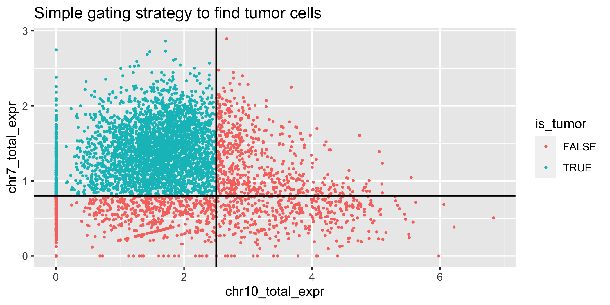
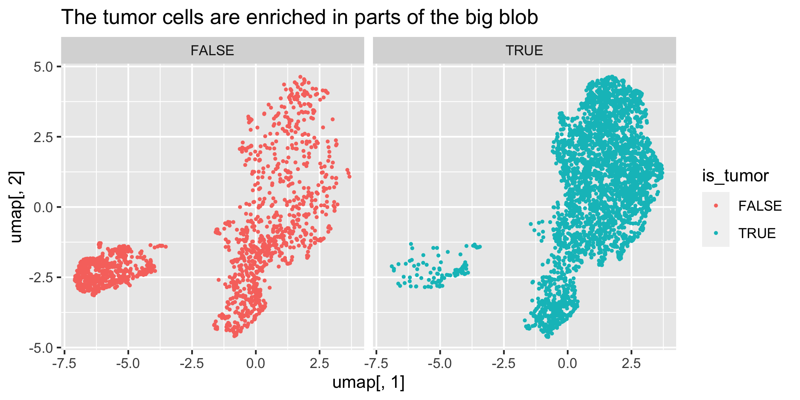
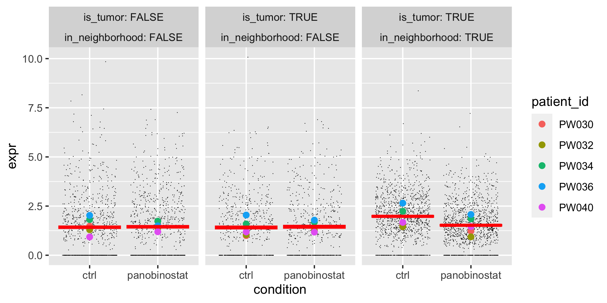

<!-- README.md is generated from README.Rmd. Please edit that file -->

# Latent Embedding Multivariate Regression (LEMUR)

<!-- badges: start -->
<!-- badges: end -->

The goal of `lemur` is to simplify analysis the of multi-condition
single-cell data. If you have collected a single-cell RNA-seq dataset
with more than one condition, `lemur` predicts for each cell and gene
how much the expression would change if the cell had been in the other
condition. Furthermore, `lemur` finds neighborhoods of cells that show
consistent differential expression. The results are statistically
validated using a pseudo-bulk differential expression test on hold-out
data using
[glmGamPoi](https://bioconductor.org/packages/release/bioc/html/glmGamPoi.html)
or [edgeR]().

`lemur` implements a novel framework to disentangle the effects of known
covariates, latent cell states, and their interactions. At the core, is
a combination of matrix factorization and regression analysis
implemented as geodesic regression on Grassmann manifolds. We call this
*latent embedding multivariate regression*. For more details see our
[preprint](https://www.biorxiv.org/content/10.1101/2023.03.06.531268v1).

<figure>

<figcaption aria-hidden="true">Schematic of the matrix decomposition at
the core of LEMUR</figcaption>
</figure>

## Installation

You can install the development version of lemur from Github:

``` r
devtools::install_github("const-ae/lemur")
```

`lemur` depends on recent features from
[`glmGamPoi`](https://github.com/const-ae/glmGamPoi), so make sure that
`packageVersion("glmGamPoi")` is larger than `1.12.0`.

## A word of caution

This package is being actively developed, and I am still making breaking
changes. I would be delighted if you decide to try out the package.
Please do open an issue if you think you found a bug, have an idea for a
cool feature, or have any questions about how LEMUR works. Consider this
an *alpha* release with the goal to gather feedback, but be aware that
code written against the current version of lemur might not work in the
future.

## Quick start

``` r
library("lemur")
library("SingleCellExperiment")

fit <- lemur(sce, design = ~ patient_id + condition, n_embedding = 15)
fit <- align_harmony(fit)   # This step is optional
fit <- test_de(fit, contrast = cond(condition = "ctrl") - cond(condition = "panobinostat"))
nei <- find_de_neighborhoods(fit, group_by = vars(patient_id, condition))
```

## A worked through example

We will demonstrate `lemur` using a dataset published by [Zhao et
al. (2021)](https://doi.org/10.1186/s13073-021-00894-y). The data
consist of tumor biopsies from five glioblastomas which were treated
with the drug panobinostat and with a control. Accordingly, we will
analyze ten samples (patient-treatment combinations) using a paired
experimental design.

We start by loading some required packages.

``` r
library("tidyverse")
library("SingleCellExperiment")
library("lemur")
set.seed(42)
```

We use a reduced-size version of the glioblastoma data that ships with
the `lemur` package.

``` r
data(glioblastoma_example_data)
glioblastoma_example_data
#> class: SingleCellExperiment 
#> dim: 300 5000 
#> metadata(0):
#> assays(2): counts logcounts
#> rownames(300): ENSG00000210082 ENSG00000118785 ... ENSG00000167468
#>   ENSG00000139289
#> rowData names(6): gene_id symbol ... strand. source
#> colnames(5000): CGCCAGAGCGCA AGCTTTACTGCG ... TGAACAGTGCGT TGACCGGAATGC
#> colData names(10): patient_id treatment_id ... sample_id id
#> reducedDimNames(0):
#> mainExpName: NULL
#> altExpNames(0):
```

Initially, the data separates by the known covariates `patient_id` and
`condition`.

``` r
orig_umap <- uwot::umap(as.matrix(t(logcounts(glioblastoma_example_data))))

as_tibble(colData(glioblastoma_example_data)) %>%
  mutate(umap = orig_umap) %>%
  ggplot(aes(x = umap[,1], y = umap[,2])) +
    geom_point(aes(color = patient_id, shape = condition), size = 0.5) +
    labs(title = "UMAP of logcounts")
```


We fit the LEMUR model by calling `lemur()`. We provide the experimental
design using a formula. The elements of the formula can refer to columns
of the `colData` of the `SingleCellExperiment` object.

We also set the number of latent dimensions (`n_embedding`), which has a
similar interpretation as the number of dimensions in PCA.

The `test_fraction` argument sets the fraction of cells which are
exclusively used to test for differential expression and not for
inferring the LEMUR parameters. It balances the sensitivity to detect
subtle patterns in the latent space against the power to detect
differentially expressed genes.

``` r
fit <- lemur(glioblastoma_example_data, design = ~ patient_id + condition, 
             n_embedding = 15, test_fraction = 0.5)
#> Storing 50% of the data (2500 cells) as test data.
#> Regress out global effects using linear method.
#> Find base point for differential embedding
#> Fit differential embedding model
#> Initial error: 1.78e+06
#> ---Fit Grassmann linear model
#> Final error: 1.11e+06

fit
#> class: lemur_fit 
#> dim: 300 5000 
#> metadata(9): n_embedding design ... use_assay row_mask
#> assays(2): counts logcounts
#> rownames(300): ENSG00000210082 ENSG00000118785 ... ENSG00000167468
#>   ENSG00000139289
#> rowData names(6): gene_id symbol ... strand. source
#> colnames(5000): CGCCAGAGCGCA AGCTTTACTGCG ... TGAACAGTGCGT TGACCGGAATGC
#> colData names(10): patient_id treatment_id ... sample_id id
#> reducedDimNames(2): linearFit embedding
#> mainExpName: NULL
#> altExpNames(0):
```

The `lemur()` function returns a `lemur_fit` object which extends
`SingleCellExperiment`. It supports subsetting and all the usual data
accessor methods (e.g., `nrow`, `assay`, `colData`, `rowData`). In
addition, `lemur` overloads the `$` operator to allow easy access to
additional fields produced by the LEMUR model. For example, the
low-dimensional embedding can be accessed using `fit$embedding`:

Optionally, we can further align corresponding cells using manually
annotated cell types (`align_by_grouping`) or an automated alignment
procedure (e.g., `align_harmony`). This ensures that corresponding cells
are close to each other in the `fit$embedding`.

``` r
fit <- align_harmony(fit)
#> Select cells that are considered close with 'harmony'
#> Transposing data matrix
```

I will make a UMAP of the `fit$embedding`. This is similar to working on
the integrated PCA space in a traditional single-cell analysis.

``` r
umap <- uwot::umap(t(fit$embedding))

as_tibble(fit$colData) %>%
  mutate(umap = umap) %>%
  ggplot(aes(x = umap[,1], y = umap[,2])) +
    geom_point(aes(color = patient_id), size = 0.5) +
    facet_wrap(vars(condition)) +
    labs(title = "UMAP of latent space from LEMUR")
```


Next, we will predict the effect of the panobinostat treatment for each
gene and cell. The `test_de` function takes a `lemur_fit` object and
returns the object with a new assay `"DE"`. This assay contains the
predicted log fold change between the conditions specified in
`contrast`. Note that `lemur` implements a special notation for
contrasts. Instead of providing a contrast vector or design matrix
column names, you provide for each *condition* the levels, and `lemur`
automatically forms the contrast vector. This makes the contrast more
readable.

``` r
fit <- test_de(fit, contrast = cond(condition = "panobinostat") - cond(condition = "ctrl"))
```

We can pick any gene and show the differential expression pattern on the
UMAP plot:

``` r
sel_gene <- "ENSG00000172020" # is GAP43

tibble(umap = umap) %>%
  mutate(de = assay(fit, "DE")[sel_gene,]) %>%
  ggplot(aes(x = umap[,1], y = umap[,2])) +
    geom_point(aes(color = de)) +
    scale_color_gradient2() +
    labs(title = "Differential expression on UMAP plot")
```


Alternatively, we can use the matrix of differential expression values
(`assay(fit, "DE")`) to guide the selection of cell neighborhoods that
show consistent differential expression. `find_de_neighborhoods`
validates the results with a pseudobulked diferential expression test.
For this it uses the `fit$test_data` which was put aside in the first
`lemur()` call. In addition, `find_de_neighborhoods` assess if the
difference between the conditions is significantly larger for the cells
inside the neighborhood than the cells outside the neighborhood (see
columns starting with `did`, short for difference-in-difference).

The `group_by` argument determines how the pseudobulk samples are
formed. It specifies the columns in the `fit$colData` that are used to
define a sample and is inspired by the `group_by` function in `dplyr`.
Typically, you provide the covariates that were used for the
experimental design plus the sample id (in this case `patient_id`).

``` r
neighborhoods <- find_de_neighborhoods(fit, group_by = vars(patient_id, condition))
#> Find optimal neighborhood using zscore.
#> Validate neighborhoods using test data
#> Form pseudobulk (summing counts)
#> Calculate size factors for each gene
#> Fit glmGamPoi model on pseudobulk data
#> Fit diff-in-diff effect

as_tibble(neighborhoods) %>%
  left_join(as_tibble(rowData(fit)[,1:2]), by = c("name" = "gene_id")) %>%
  relocate(symbol, .before = "name") %>%
  arrange(pval) %>%
  dplyr::select(symbol, neighborhood, name, n_cells, pval, adj_pval, lfc, did_lfc) 
#> # A tibble: 300 × 8
#>    symbol neighborhood  name            n_cells    pval adj_pval    lfc  did_lfc
#>    <chr>  <I<list>>     <chr>             <int>   <dbl>    <dbl>  <dbl>    <dbl>
#>  1 MT1X   <chr [3,265]> ENSG00000187193    3265 2.68e-6 0.000804  3.24  -1.52   
#>  2 CALM1  <chr [2,805]> ENSG00000198668    2805 1.13e-4 0.0122    0.998 -0.524  
#>  3 POLR2L <chr [3,864]> ENSG00000177700    3864 1.22e-4 0.0122    1.33  -0.757  
#>  4 NEAT1  <chr [4,049]> ENSG00000245532    4049 2.81e-4 0.0211    1.83  -0.682  
#>  5 PMP2   <chr [3,672]> ENSG00000147588    3672 4.43e-4 0.0237   -1.47   0.332  
#>  6 MT2A   <chr [1,378]> ENSG00000125148    1378 5.20e-4 0.0237    1.63   0.00142
#>  7 ATP5G3 <chr [4,129]> ENSG00000154518    4129 5.53e-4 0.0237    0.683 -0.326  
#>  8 SKP1   <chr [3,646]> ENSG00000113558    3646 8.29e-4 0.0311    0.606 -0.185  
#>  9 EEF1A1 <chr [3,806]> ENSG00000156508    3806 1.13e-3 0.0377   -0.620  0.445  
#> 10 A2M    <chr [3,752]> ENSG00000175899    3752 1.57e-3 0.0442   -1.61   0.895  
#> # ℹ 290 more rows
```

To continue, we investigate one gene for which the neighborhood shows a
significant differential expression pattern: here we choose a *CXCL8*
(also known as interleukin 8), an important inflammation signalling
molecule. We see that it is upregulated by panobinostat in a subset of
cells (blue). We chose this gene because it (1) had a significant change
between panobinostat and negative control condition (`adj_pval` column)
and (2) showed much larger differential expression for the cells inside
the neighborhood than for the cells outside (`did_lfc` column).

``` r
sel_gene <- "ENSG00000169429" # is CXCL8

tibble(umap = umap) %>%
  mutate(de = assay(fit, "DE")[sel_gene,]) %>%
  ggplot(aes(x = umap[,1], y = umap[,2])) +
    geom_point(aes(color = de)) +
    scale_color_gradient2() +
    labs(title = "Differential expression on UMAP plot")
```


To plot the boundaries of the differential expression neighborhood, we
create a helper dataframe and use the `geom_density2d` function from
`ggplot2`. To avoid the cutting of the boundary to the extremes of the
cell coordinates, add `lims` to the plot with an appropriately large
limit.

``` r
neighborhood_coordinates <- neighborhoods %>%
  dplyr::filter(name == sel_gene) %>%
  unnest(c(neighborhood)) %>%
  dplyr::rename(cell_id = neighborhood) %>%
  left_join(tibble(cell_id = rownames(umap), umap), by = "cell_id") %>%
  dplyr::select(name, cell_id, umap)

tibble(umap = umap) %>%
  mutate(de = assay(fit, "DE")[sel_gene,]) %>%
  ggplot(aes(x = umap[,1], y = umap[,2])) +
    geom_point(aes(color = de)) +
    scale_color_gradient2() +
    geom_density2d(data = neighborhood_coordinates, breaks = 0.5, 
                   contour_var = "ndensity", color = "black") +
    labs(title = "Differential expression with neighborhood boundary")
```


To summarize the results, we make a volcano plot of the differential
expression results to better understand the expression differences
across all genes.

``` r
neighborhoods %>%
  drop_na() %>%
  ggplot(aes(x = lfc, y = -log10(pval))) +
    geom_point(aes(color  = adj_pval < 0.1)) +
    labs(title = "Volcano plot of the neighborhoods")
```


``` r

neighborhoods %>%
  drop_na() %>%
  ggplot(aes(x = n_cells, y = -log10(pval))) +
    geom_point(aes(color  = adj_pval < 0.1)) +
    labs(title = "Neighborhood size vs neighborhood significance")
```


This analysis was conducted without using any cell type information.
Often, additional cell type information is available or can be annotated
manually. Here, we can for example distinguish the tumor cells from
cells of the microenvironment, because the tumors had a chromosome 10
deletion and chromosome 7 duplication. We build a simple classifier to
distinguish the cells accordingly. (This is just to illustrate the
process; for a real analysis, we would use more sophisticated methods.)

``` r
tumor_label_df <- tibble(cell_id = colnames(fit),
       chr7_total_expr = colMeans(logcounts(fit)[rowData(fit)$chromosome == "7",]),
       chr10_total_expr = colMeans(logcounts(fit)[rowData(fit)$chromosome == "10",])) %>%
  mutate(is_tumor = chr7_total_expr > 0.8 & chr10_total_expr < 2.5)


ggplot(tumor_label_df, aes(x = chr10_total_expr, y = chr7_total_expr)) +
    geom_point(aes(color = is_tumor), size = 0.5) +
    geom_hline(yintercept = 0.8) +
    geom_vline(xintercept = 2.5) +
    labs(title = "Simple gating strategy to find tumor cells")
```



``` r

tibble(umap = umap) %>%
  mutate(is_tumor = tumor_label_df$is_tumor) %>%
  ggplot(aes(x = umap[,1], y = umap[,2])) +
    geom_point(aes(color = is_tumor), size = 0.5) +
    labs(title = "The tumor cells are enriched in parts of the big blob") +
    facet_wrap(vars(is_tumor))
```



We use the cell annotation, to focus our neighborhood finding on
subpopulations of the tumor.

``` r
tumor_fit <- fit[, tumor_label_df$is_tumor]
tum_nei <- find_de_neighborhoods(tumor_fit, group_by = vars(patient_id, condition), verbose = FALSE)

as_tibble(tum_nei) %>%
  left_join(as_tibble(rowData(fit)[,1:2]), by = c("name" = "gene_id")) %>%
  dplyr::relocate(symbol, .before = "name") %>%
  filter(adj_pval < 0.1) %>%
  arrange(did_pval)  %>%
  dplyr::select(symbol, name, neighborhood, n_cells, adj_pval, lfc, did_pval, did_lfc) %>%
  print(n = 10)
#> # A tibble: 42 × 8
#>    symbol name            neighborhood  n_cells adj_pval    lfc did_pval did_lfc
#>    <chr>  <chr>           <I<list>>       <int>    <dbl>  <dbl>    <dbl>   <dbl>
#>  1 HSPA1A ENSG00000204389 <chr [1,872]>    1872  0.0617   1.12    0.0112  -1.30 
#>  2 GPX4   ENSG00000167468 <chr [3,172]>    3172  0.0630   0.536   0.0181  -0.833
#>  3 RPL36  ENSG00000130255 <chr [1,676]>    1676  0.0750   0.507   0.0202  -0.466
#>  4 HMGB1  ENSG00000189403 <chr [1,862]>    1862  0.0251  -1.03    0.0344   0.687
#>  5 CCL3   ENSG00000277632 <chr [1,627]>    1627  0.0617  -2.24    0.0457   1.69 
#>  6 NACA   ENSG00000196531 <chr [1,853]>    1853  0.0697  -0.497   0.0638   0.336
#>  7 SQSTM1 ENSG00000161011 <chr [2,432]>    2432  0.0816   0.482   0.0666  -0.635
#>  8 RPL10  ENSG00000147403 <chr [2,900]>    2900  0.0636  -0.450   0.0966   0.320
#>  9 MT1X   ENSG00000187193 <chr [1,671]>    1671  0.00374  3.33    0.100   -1.11 
#> 10 PLP1   ENSG00000123560 <chr [1,041]>    1041  0.0697  -1.81    0.175    1.18 
#> # ℹ 32 more rows
```

Focusing on RPS11, we see that panobinostat mostly has no effect on its
expression, except for a subpopulation of tumor cells where RPS11 was
originally upregulated and panobinostat downregulates the expression. A
small caveat: this analysis is conducted on a subset of all cells and
should be interpreted carefully. Yet, this section demonstrates how
`lemur` can be used to find tumor subpopulations which show differential
responses to treatments.

``` r
sel_gene <- "ENSG00000142534" # is RPS11

as_tibble(colData(fit)) %>%
  mutate(expr = assay(fit, "logcounts")[sel_gene,]) %>%
  mutate(is_tumor = tumor_label_df$is_tumor) %>%
  mutate(in_neighborhood = id %in% filter(tum_nei, name == sel_gene)$neighborhood[[1]]) %>%
  ggplot(aes(x = condition, y = expr)) +
    geom_jitter(size = 0.3, stroke = 0) +
    geom_point(data = . %>% summarize(expr = mean(expr), .by = c(condition, patient_id, is_tumor, in_neighborhood)),
               aes(color = patient_id), size = 2) +
    stat_summary(fun.data = mean_se, geom = "crossbar", color = "red") +
    facet_wrap(vars(is_tumor, in_neighborhood), labeller = label_both) 
```



# FAQ

##### I have already integrated my data using Harmony / MNN / Seurat. Can I call `lemur` directly with the aligned data?

No. You need to call `lemur` with the unaligned data so that it can
learn how much the expression of each gene changes between conditions.

##### Can I call lemur with [sctransformed](https://github.com/satijalab/sctransform) instead of log-transformed data?

Yes. You can call lemur with any variance stabilized count matrix. Based
on a [previous
project](https://www.biorxiv.org/content/10.1101/2021.06.24.449781v4), I
recommend to use log-transformation, but other methods will work just
fine.

##### My data appears less integrated after calling `lemur()` than before. What is happening?!

This is a known issue and can be caused if the data has large
compositional shifts (for example, if one cell type disappears). The
problem is that the initial linear regression step, which centers the
conditions relative to each other, overcorrects and introduces a
consistent shift in the latent space. You can either use
`align_by_grouping` / `align_harmony` to correct for this effect or
manually fix the regression coefficient to zero:

``` r
fit <- lemur(sce, design = ~ patient_id + condition, n_embedding = 15, linear_coefficient_estimator = "zero")
```

##### The conditions still separate if I plot the data using UMAP / tSNE. Even after calling `align_harmony` / `align_neighbors`. What should I do?

You can try to increase `n_embedding`. If this still does not help,
there is little use in inferring differential expression neighborhoods.
But as I haven’t encountered such a dataset yet, I would like to try it
out myself. If you can share the data publicly, please open an issue.

##### How do I make `lemur` faster?

Several parameters influence the duration to fit the LEMUR model and
find differentially expressed neighborhoods:

- Make sure that your data is stored in memory (not a `DelayedArray`)
  either as a sparse dgCMatrix or dense matrix.
- A larger `test_fraction` means fewer cells are used to fit the model
  (and more cells are used for the DE test), which speeds up many steps.
- A smaller `n_embedding` reduces the latent dimensions of the fit,
  which makes the model less flexible, but speeds up the `lemur()` call.
- Providing a pre-calculated set of matching cells and calling
  `align_grouping` is faster than `align_harmony`.
- Setting `selection_procedure = "contrast"` in `find_de_neighborhoods`
  often produces better neighborhoods, but is a lot slower than
  `selection_procedure = "zscore"`.
- Setting `size_factor_method = "ratio"` in `find_de_neighborhoods`
  makes the DE more powerful, but is a lot slower than
  `size_factor_method = "normed_sum"`.

# Session Info

``` r
sessionInfo()
#> R version 4.3.0 (2023-04-21)
#> Platform: x86_64-apple-darwin20 (64-bit)
#> Running under: macOS Big Sur 11.7.6
#> 
#> Matrix products: default
#> BLAS:   /Library/Frameworks/R.framework/Versions/4.3-x86_64/Resources/lib/libRblas.0.dylib 
#> LAPACK: /Library/Frameworks/R.framework/Versions/4.3-x86_64/Resources/lib/libRlapack.dylib;  LAPACK version 3.11.0
#> 
#> locale:
#> [1] en_US.UTF-8/en_US.UTF-8/en_US.UTF-8/C/en_US.UTF-8/en_US.UTF-8
#> 
#> time zone: Europe/Berlin
#> tzcode source: internal
#> 
#> attached base packages:
#> [1] stats4    stats     graphics  grDevices utils     datasets  methods  
#> [8] base     
#> 
#> other attached packages:
#>  [1] lubridate_1.9.2             forcats_1.0.0              
#>  [3] stringr_1.5.0               dplyr_1.1.2                
#>  [5] purrr_1.0.1                 readr_2.1.4                
#>  [7] tidyr_1.3.0                 tibble_3.2.1               
#>  [9] ggplot2_3.4.2               tidyverse_2.0.0            
#> [11] SingleCellExperiment_1.22.0 SummarizedExperiment_1.30.2
#> [13] Biobase_2.60.0              GenomicRanges_1.52.0       
#> [15] GenomeInfoDb_1.36.0         IRanges_2.34.0             
#> [17] S4Vectors_0.38.1            BiocGenerics_0.46.0        
#> [19] MatrixGenerics_1.12.2       matrixStats_1.0.0          
#> [21] lemur_0.99.6               
#> 
#> loaded via a namespace (and not attached):
#>  [1] gtable_0.3.3              xfun_0.39                
#>  [3] lattice_0.21-8            tzdb_0.4.0               
#>  [5] vctrs_0.6.2               tools_4.3.0              
#>  [7] bitops_1.0-7              generics_0.1.3           
#>  [9] fansi_1.0.4               highr_0.10               
#> [11] pkgconfig_2.0.3           Matrix_1.5-4.1           
#> [13] sparseMatrixStats_1.13.4  lifecycle_1.0.3          
#> [15] GenomeInfoDbData_1.2.10   farver_2.1.1             
#> [17] compiler_4.3.0            munsell_0.5.0            
#> [19] RhpcBLASctl_0.23-42       codetools_0.2-19         
#> [21] glmGamPoi_1.13.3          htmltools_0.5.5          
#> [23] RCurl_1.98-1.12           yaml_2.3.7               
#> [25] pillar_1.9.0              crayon_1.5.2             
#> [27] MASS_7.3-60               uwot_0.1.14              
#> [29] DelayedArray_0.26.3       tidyselect_1.2.0         
#> [31] digest_0.6.31             stringi_1.7.12           
#> [33] splines_4.3.0             labeling_0.4.2           
#> [35] cowplot_1.1.1             fastmap_1.1.1            
#> [37] grid_4.3.0                colorspace_2.1-0         
#> [39] cli_3.6.1                 harmony_1.0.3            
#> [41] magrittr_2.0.3            S4Arrays_1.0.4           
#> [43] utf8_1.2.3                withr_2.5.0              
#> [45] DelayedMatrixStats_1.22.0 scales_1.2.1             
#> [47] timechange_0.2.0          rmarkdown_2.22           
#> [49] XVector_0.40.0            hms_1.1.3                
#> [51] evaluate_0.21             knitr_1.43               
#> [53] RcppAnnoy_0.0.20          irlba_2.3.5.1            
#> [55] rlang_1.1.1               isoband_0.2.7            
#> [57] Rcpp_1.0.10               glue_1.6.2               
#> [59] rstudioapi_0.14           R6_2.5.1                 
#> [61] zlibbioc_1.46.0
```
