<!-- README.md is generated from README.Rmd. Please edit that file -->
<!-- 'Stangle' analogon: knitr::purl("Introduction.qmd")
-->

# Latent Embedding Multivariate Regression (LEMUR)

<!-- badges: start -->
<!-- badges: end -->

<figure>
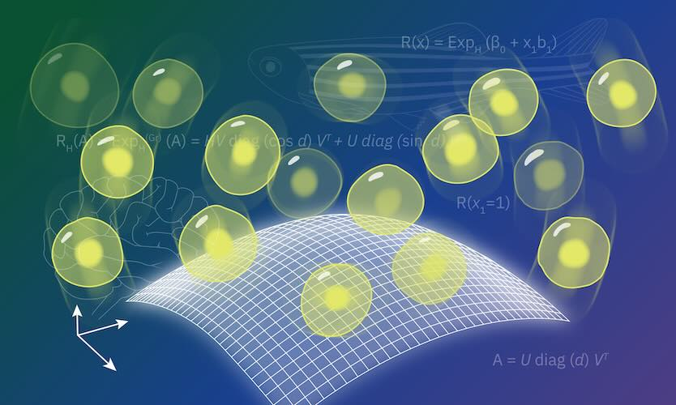
<figcaption aria-hidden="true">Artistic rendering of some LEMUR
concepts</figcaption>
</figure>

The goal of
[`lemur`](https://www.biorxiv.org/content/10.1101/2023.03.06.531268) is
to simplify the analysis of multi-condition single-cell data. If you
have collected a single-cell RNA-seq dataset with more than one
condition, `lemur` predicts for each cell and gene what the expression
data would be in all of the other conditions. Furthermore, `lemur` finds
neighborhoods of cells that show consistent differential expression. The
results are statistically validated using a pseudo-bulk differential
expression test on hold-out data using
[glmGamPoi](https://bioconductor.org/packages/glmGamPoi/) or
[edgeR](https://bioconductor.org/packages/edgeR/).

`lemur` implements a novel framework to disentangle the effects of known
covariates, latent cell states, and their interactions. At the core, is
a combination of matrix factorization and regression analysis
implemented as geodesic regression on Grassmann manifolds. We call this
*latent embedding multivariate regression*. For more details see our
[preprint](https://www.biorxiv.org/content/10.1101/2023.03.06.531268).

<figure>
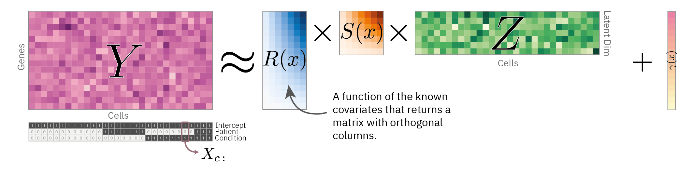
<figcaption aria-hidden="true">Schematic of the matrix decomposition at
the core of LEMUR</figcaption>
</figure>

## Installation

You can install `lemur` directly from Bioconductor. Just paste the
following snippet into your R console:

``` r
if (!requireNamespace("BiocManager", quietly = TRUE))
    install.packages("BiocManager")

BiocManager::install("lemur")
```

Alternatively, you can install the package from Github using `devtools`:

``` r
devtools::install_github("const-ae/lemur")
```

## A note to users

We continue working on improvements to this package. We are delighted if
you decide to try out the package. Please use the [Bioconductor
forum](https://support.bioconductor.org/) or open an issue in the
[GitHub repository](https://github.com/const-ae/lemur/) if you think you
found a bug, have an idea for a cool feature, or have any questions
about how LEMUR works.

## Overview

A basic lemur workflow is as easy as the following.

``` r
# ... sce is a SingleCellExperiment object with your data 
fit <- lemur(sce, design = ~ patient_id + condition, n_embedding = 15)
fit <- align_harmony(fit)   # This step is optional
fit <- test_de(fit, contrast = cond(condition = "ctrl") - cond(condition = "panobinostat"))
nei <- find_de_neighborhoods(fit, group_by = vars(patient_id, condition))
```

We will now go through these steps one by one.

# A worked through example

We demonstrate `lemur` using data by [Zhao et
al. (2021)](https://doi.org/10.1186/s13073-021-00894-y). The data
consist of tumor biopsies from five glioblastomas, each of which was
treated with the drug panobinostat and with a control. Accordingly, we
look at ten samples in a paired experimental design.

We start by loading required packages.

``` r
library("tidyverse")
library("SingleCellExperiment")
library("lemur")
set.seed(42)
```

The `lemur` package ships with a reduced-size version of the
glioblastoma data, which we use in the following.

``` r
data("glioblastoma_example_data", package = "lemur")
glioblastoma_example_data
#> class: SingleCellExperiment 
#> dim: 300 5000 
#> metadata(0):
#> assays(2): counts logcounts
#> rownames(300): ENSG00000210082 ENSG00000118785 ... ENSG00000167468 ENSG00000139289
#> rowData names(6): gene_id symbol ... strand. source
#> colnames(5000): CGCCAGAGCGCA AGCTTTACTGCG ... TGAACAGTGCGT TGACCGGAATGC
#> colData names(10): patient_id treatment_id ... sample_id id
#> reducedDimNames(0):
#> mainExpName: NULL
#> altExpNames(0):
```

As is, the data separated by the known covariates `patient_id` and
`condition`.

``` r
orig_umap <- uwot::umap(as.matrix(t(logcounts(glioblastoma_example_data))))

as_tibble(colData(glioblastoma_example_data)) |>
  mutate(umap = orig_umap) |>
  ggplot(aes(x = umap[,1], y = umap[,2])) +
    geom_point(aes(color = patient_id, shape = condition), size = 0.5) +
    labs(title = "UMAP of logcounts") + coord_fixed()
```

<div class="figure" style="text-align: center">


<p class="caption">
UMAP of the example dataset `glioblastoma_example_data`, prior to any
between-condition alignment.
</p>

</div>

We fit the LEMUR model by calling the function `lemur`. We provide the
experimental design using a formula. The elements of the formula can
refer to columns of the `colData` of the `SingleCellExperiment` object.

We also set the number of latent dimensions, `n_embedding`, which has a
similar interpretation as the number of dimensions in PCA. The
`test_fraction` argument sets the fraction of cells which are
exclusively used to test for differential expression and not for
inferring the LEMUR parameters. It balances the sensitivity to detect
subtle patterns in the latent space against the power to detect
differentially expressed genes.
<!--FIXME Do we need to bother users with this parameter here? Just use a reasonable default, and later have a section on "variations", like in the [DESeq2 vignette](https://www.bioconductor.org/packages/release/bioc/vignettes/DESeq2/inst/doc/DESeq2.html#variations-to-the-standard-workflow) where such things are mentioned?-->

``` r
fit <- lemur(glioblastoma_example_data, design = ~ patient_id + condition, 
             n_embedding = 15, test_fraction = 0.5)
fit
#> class: lemur_fit 
#> dim: 300 5000 
#> metadata(9): n_embedding design ... use_assay row_mask
#> assays(2): counts logcounts
#> rownames(300): ENSG00000210082 ENSG00000118785 ... ENSG00000167468 ENSG00000139289
#> rowData names(6): gene_id symbol ... strand. source
#> colnames(5000): CGCCAGAGCGCA AGCTTTACTGCG ... TGAACAGTGCGT TGACCGGAATGC
#> colData names(10): patient_id treatment_id ... sample_id id
#> reducedDimNames(2): linearFit embedding
#> mainExpName: NULL
#> altExpNames(0):
```

The `lemur` function returns an object of class lemur_fit, which extends
the `SingleCellExperiment` class. It supports subsetting and all the
usual accessor methods (e.g., `nrow`, `assay`, `colData`, `rowData`). In
addition, `lemur` overloads the `$` operator to allow easy access to
additional fields produced by the LEMUR model. For example, the
low-dimensional embedding can be accessed using `fit$embedding`:

``` r
fit$embedding |> str()
#>  num [1:15, 1:5000] 8.7543 0.0759 -1.0401 4.8462 0.529 ...
#>  - attr(*, "dimnames")=List of 2
#>   ..$ : NULL
#>   ..$ : chr [1:5000] "CGCCAGAGCGCA" "AGCTTTACTGCG" "AGGATGACCGCA" "AGAACTATTTTT" ...
```

Optionally, we can further align corresponding cells using manually
annotated cell types (`align_by_grouping`) or an automated alignment
procedure (e.g., `align_harmony`). This ensures that corresponding cells
are close to each other in the `fit$embedding`.

``` r
fit <- align_harmony(fit)
#> Select cells that are considered close with 'harmony'
```

<!--FIXME "Select cells that are considered close with 'harmony'" -- should it not be 'Selecting' to avoid confusion with imperative verb form? Is the message even needed? -->

@fig-lemur_umap shows a UMAP of `fit$embedding`. This is similar to
working on the integrated PCA space in a traditional single-cell
analysis.

``` r
umap <- uwot::umap(t(fit$embedding))

as_tibble(fit$colData) |>
  mutate(umap = umap) |>
  ggplot(aes(x = umap[,1], y = umap[,2])) +
    geom_point(aes(color = patient_id), size = 0.5) +
    facet_wrap(vars(condition)) + coord_fixed()
```

<div class="figure" style="text-align: center">


<p class="caption">
UMAPs of `fit$embedding`. The points are shown separately for the two
conditions, but reside in the same latent space.
</p>

</div>

Next, let’s predict the effect of the panobinostat treatment for
**each** cell and each gene – even for the cells that were observed in
the control condition. The `test_de` function takes a `lemur_fit` object
and returns the object with a new slot (in `SummarizedExperiment`
parlance: `assay`) called `DE`. This slot contains the predicted
logarithmic fold changes between the two conditions specified in
`contrast`. Note that `lemur` implements a special notation for
contrasts. Instead of providing a contrast vector or design matrix
column names, you provide for each *condition* the levels, and `lemur`
automatically forms the contrast vector. This is intended to make the
notation more readable.

``` r
fit <- test_de(fit, contrast = cond(condition = "panobinostat") - cond(condition = "ctrl"))
```

We can pick any gene, say GAP43, which in our data is represented by its
Ensembl gene ID ENSG00000172020, and show its differential expression
pattern on the UMAP plot:

``` r
df <- tibble(umap = umap) |>
  mutate(de = assay(fit, "DE")["ENSG00000172020", ])
 
ggplot(df, aes(x = umap[,1], y = umap[,2])) +
    geom_point(aes(color = de)) +
    scale_color_gradient2(low = "#FFD800", high= "#0056B9") + coord_fixed()

ggplot(df, aes(x = de)) + geom_histogram(bins = 100)
```

<div class="figure" style="text-align: center">

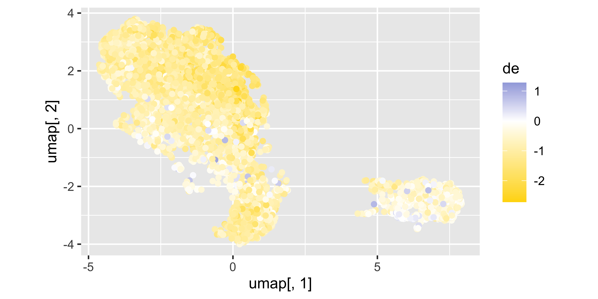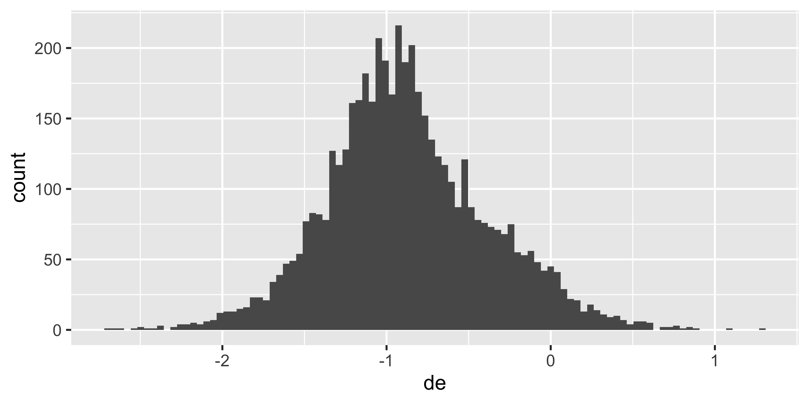
<p class="caption">
Differential expression (log fold changes) of GAP43
</p>

</div>

More systematically, we can now search through all the genes, and use
their expression values (`assay(fit, "DE")`) to search for cell
neighborhoods (sets of cells that are close together in latent space)
that show consistent differential expression. The function
`find_de_neighborhoods` validates the results of such a search with a
pseudobulked diferential expression test. For that, it uses the test
data (`fit$test_data`) that was put aside in the first call to
`lemur()`. In addition, `find_de_neighborhoods` assesses if the
difference between the conditions is significantly larger for the cells
inside the neighborhood than the cells outside the neighborhood (see
columns starting with `did`, short for difference-in-difference).

The `group_by` argument determines how the pseudobulk samples are
formed. It specifies the columns in the `fit$colData` that are used to
define a sample and is inspired by the `group_by` function in `dplyr`.
Typically, you provide the covariates that were used for the
experimental design plus the sample id (in this case `patient_id`).

``` r
neighborhoods <- find_de_neighborhoods(fit, group_by = vars(patient_id, condition))

as_tibble(neighborhoods) |>
  left_join(as_tibble(rowData(fit)[,1:2]), by = c("name" = "gene_id")) |>
  relocate(symbol, .before = "name") |>
  arrange(pval) |>
  head(5)
#> # A tibble: 5 × 14
#>   symbol name     neighborhood n_cells sel_statistic    pval adj_pval f_statistic   df1   df2    lfc
#>   <chr>  <chr>    <I<list>>      <int>         <dbl>   <dbl>    <dbl>       <dbl> <int> <dbl>  <dbl>
#> 1 MT1X   ENSG000… <chr>           2410          42.8 6.93e-6  0.00208       148.      1  6.85  3.20 
#> 2 PMP2   ENSG000… <chr>           3880        -160.  3.89e-5  0.00583        86.8     1  6.85 -1.33 
#> 3 NEAT1  ENSG000… <chr>           3771          59.2 2.92e-4  0.0232         45.5     1  6.85  1.86 
#> 4 SKP1   ENSG000… <chr>           3196          34.1 3.59e-4  0.0232         42.5     1  6.85  0.777
#> 5 POLR2L ENSG000… <chr>           3825         115.  3.87e-4  0.0232         41.4     1  6.85  1.23 
#> # ℹ 3 more variables: did_pval <dbl>, did_adj_pval <dbl>, did_lfc <dbl>
```

<!-- FIXME can the dplyr gymnastics be offloaded from the user? Why is it a data.frame if anyway you use tibbles all round? -->

To continue, we investigate one gene for which the neighborhood shows a
significant differential expression pattern: here we choose a *CXCL8*
(also known as interleukin 8), an important inflammation signalling
molecule. We see that it is upregulated by panobinostat in a subset of
cells (blue). We chose this gene because it (1) had a significant change
between panobinostat and negative control condition (`adj_pval` column)
and (2) showed much larger differential expression for the cells inside
the neighborhood than for the cells outside (`did_lfc` column).

``` r
sel_gene <- "ENSG00000169429" # is CXCL8

p <- tibble(umap = umap) |>
  mutate(de = assay(fit, "DE")[sel_gene,]) |>
  ggplot(aes(x = umap[,1], y = umap[,2])) +
    geom_point(aes(color = de)) +
    scale_color_gradient2(low = "#FFD800", high= "#0056B9") +
    coord_fixed()
p
```

<div class="figure" style="text-align: center">

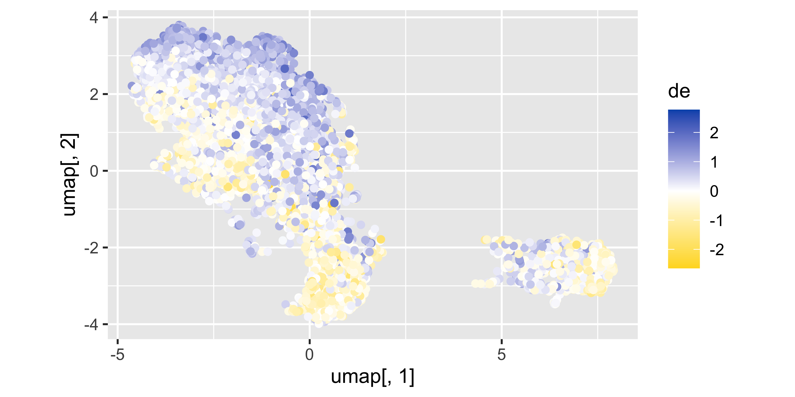
<p class="caption">
Differential expression of CXCL8 superimposed on the same UMAP plot as
in @fig-lemur_umap.
</p>

</div>

Next, we are going to try something ambitious: in the LEMUR model, the
cells in a neighborhood are separated from the rest of the cells by a
$(k-1)$-dimensional hyperplane in the $k$-dimensional latent space ($k$
being the same as `n_embedding` from above, i.e., $k=$ ). We can try to
approximate this separation as a line in the two-dimensional UMAP plot.

To this end, we create a helper dataframe and use the `geom_density2d`
function from `ggplot2`. To avoid the cutting of the boundary to the
extremes of the cell coordinates, add `lims` to the plot with an
appropriately large limit.

``` r
neighborhood_coordinates <- neighborhoods |>
  dplyr::filter(name == sel_gene) |>
  unnest(c(neighborhood)) |>
  dplyr::rename(cell_id = neighborhood) |>
  left_join(tibble(cell_id = rownames(umap), umap), by = "cell_id") |>
  dplyr::select(name, cell_id, umap)

p + geom_density2d(data = neighborhood_coordinates, breaks = seq(0.2, 0.6, by = 0.1), 
                   contour_var = "ndensity", color = "#808080") 
```

<div class="figure" style="text-align: center">

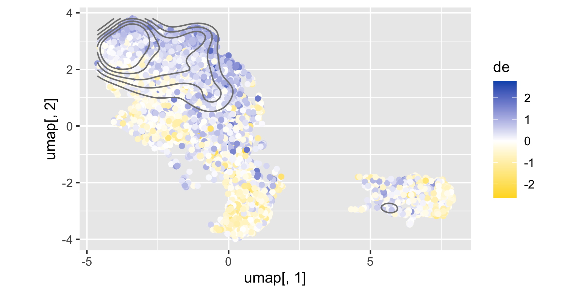
<p class="caption">
Same as @fig-umap_de2, with an attempt to draw a neighborhood boundary.
</p>

</div>

To summarize our results, we can make a volcano plot of the differential
expression results to better understand the expression differences
across all genes.

``` r
neighborhoods |>
  drop_na() |>
  ggplot(aes(x = lfc, y = -log10(pval))) +
    geom_point(aes(col  = adj_pval < 0.1)) 
```

<div class="figure" style="text-align: center">

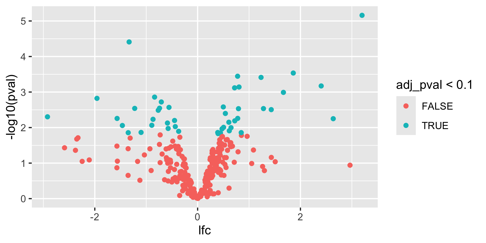
<p class="caption">
Volcano plot, each point corresponds to one neighborhood.
</p>

</div>

<!--FIXME What is the point of the following plot? That there is some dependence on size (too small is not good) but not too much? I am not sure it's that interesting for first-time users, maybe relegate this to a supplement?-->

``` r
neighborhoods |>
  drop_na() |>
  ggplot(aes(x = n_cells, y = -log10(pval))) +
    geom_point(aes(color  = adj_pval < 0.1)) 
```

<div class="figure" style="text-align: center">

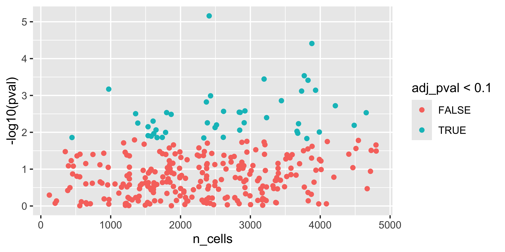
<p class="caption">
Neighborhood size vs neighborhood significance.
</p>

</div>

## Using cell type annotation

The analyses up to here were conducted without using any cell type
information. Often, such additional cell type information is available
or can be obtained from the data by other means. For instance, here, we
can distinguish the tumor cells from non-malignment other cell, using
the fact that the tumor cells had a deletion of Chromosome 10 and a
duplication of Chromosome 7. We build a simple classifier to distinguish
the cells accordingly. (This is just to illustrate the process; for a
real analysis, we would use more sophisticated methods.)

``` r
tumor_label_df <- tibble(cell_id = colnames(fit),
       chr7_total_expr  = colMeans(logcounts(fit)[rowData(fit)$chromosome == "7",]),
       chr10_total_expr = colMeans(logcounts(fit)[rowData(fit)$chromosome == "10",])) |>
  mutate(is_tumor = chr7_total_expr > 0.8 & chr10_total_expr < 2.5)

ggplot(tumor_label_df, aes(x = chr10_total_expr, y = chr7_total_expr)) +
    geom_point(aes(color = is_tumor), size = 0.5) +
    geom_hline(yintercept = 0.8) +
    geom_vline(xintercept = 2.5) 
```

<div class="figure" style="text-align: center">

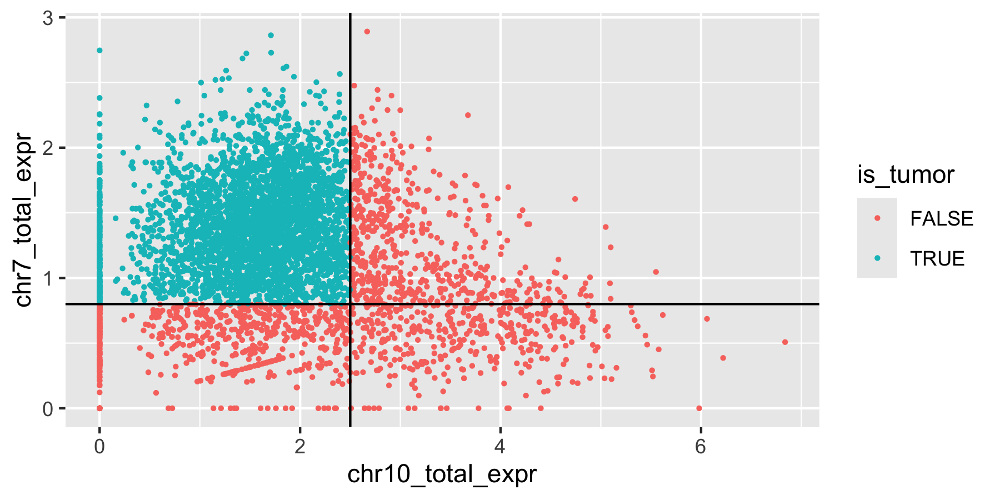
<p class="caption">
A simple gating strategy to find tumor cells
</p>

</div>

``` r
tibble(umap = umap) |>
  mutate(is_tumor = tumor_label_df$is_tumor) |>
  ggplot(aes(x = umap[,1], y = umap[,2])) +
    geom_point(aes(color = is_tumor), size = 0.5) +
    facet_wrap(vars(is_tumor)) + coord_fixed()
```

<div class="figure" style="text-align: center">

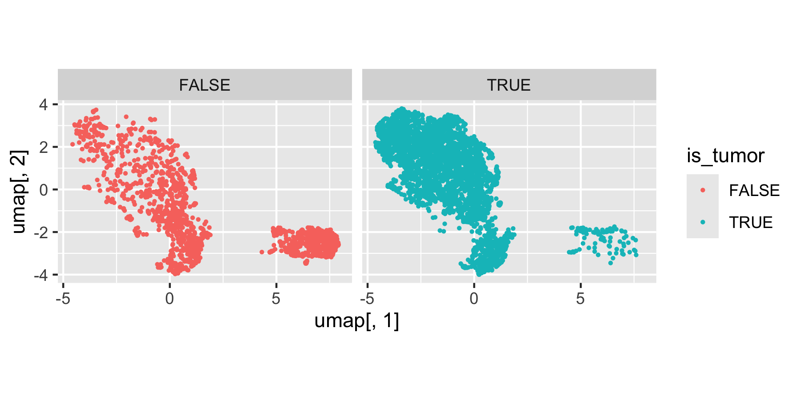
<p class="caption">
The tumor cells are enriched in parts of the big (left) blob.
</p>

</div>

We use this cell annotation to focus our neighborhood finding within the
tumor cells, to find tumor subpopulations.

``` r
tumor_fit <- fit[, tumor_label_df$is_tumor]
tum_nei <- find_de_neighborhoods(tumor_fit, group_by = vars(patient_id, condition), verbose = FALSE)

as_tibble(tum_nei) |>
  left_join(as_tibble(rowData(fit)[,1:2]), by = c("name" = "gene_id")) |>
  dplyr::relocate(symbol, .before = "name") |>
  filter(adj_pval < 0.1) |>
  arrange(did_pval)  |>
  dplyr::select(symbol, name, neighborhood, n_cells, adj_pval, lfc, did_pval, did_lfc) |>
  print(n = 10)
#> # A tibble: 39 × 8
#>    symbol name            neighborhood  n_cells adj_pval    lfc did_pval did_lfc
#>    <chr>  <chr>           <I<list>>       <int>    <dbl>  <dbl>    <dbl>   <dbl>
#>  1 CCL3   ENSG00000277632 <chr [1,795]>    1795  0.0382  -2.79   0.00777   2.65 
#>  2 CALM1  ENSG00000198668 <chr [2,077]>    2077  0.0160   1.02   0.00943  -0.731
#>  3 NAMPT  ENSG00000105835 <chr [1,885]>    1885  0.0382  -1.14   0.0706    1.03 
#>  4 POLR2L ENSG00000177700 <chr [2,428]>    2428  0.00922  1.23   0.0787   -0.557
#>  5 A2M    ENSG00000175899 <chr [2,361]>    2361  0.0790  -1.97   0.0941    1.28 
#>  6 CXCL8  ENSG00000169429 <chr [1,756]>    1756  0.0264   1.20   0.193    -0.594
#>  7 TUBA1A ENSG00000167552 <chr [2,761]>    2761  0.0782  -0.462  0.225    -0.212
#>  8 MT1X   ENSG00000187193 <chr [1,972]>    1972  0.00266  3.20   0.250    -0.674
#>  9 RPS11  ENSG00000142534 <chr [2,238]>    2238  0.0959  -0.383  0.256    -0.173
#> 10 HMGB1  ENSG00000189403 <chr [2,535]>    2535  0.0382  -0.833  0.261     0.374
#> # ℹ 29 more rows
```

Focusing on RPS11, we see that panobinostat mostly has no effect on its
expression, except for a subpopulation of tumor cells where RPS11 was
originally upregulated and panobinostat downregulates the expression. A
small caveat: this analysis is conducted on a subset of all cells and
should be interpreted carefully. Yet, this section demonstrates how
`lemur` can be used to find tumor subpopulations which show differential
responses to treatments.

``` r
sel_gene <- "ENSG00000142534" # is RPS11

as_tibble(colData(fit)) |>
  mutate(expr = assay(fit, "logcounts")[sel_gene,]) |>
  mutate(is_tumor = tumor_label_df$is_tumor) |>
  mutate(in_neighborhood = id %in% filter(tum_nei, name == sel_gene)$neighborhood[[1]]) |>
  ggplot(aes(x = condition, y = expr)) +
    geom_jitter(size = 0.3, stroke = 0) +
    geom_point(data = . %>% summarize(expr = mean(expr), .by = c(condition, patient_id, is_tumor, in_neighborhood)),
               aes(color = patient_id), size = 2) +
    stat_summary(fun.data = mean_se, geom = "crossbar", color = "red") +
    facet_wrap(vars(is_tumor, in_neighborhood), labeller = label_both) 
```

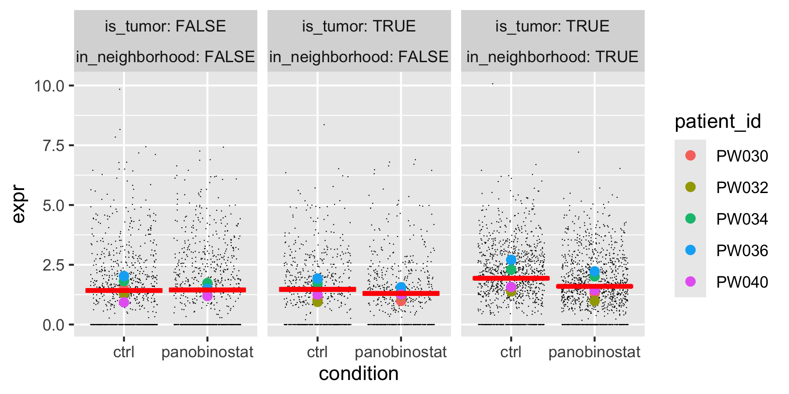

# FAQ

##### I have already integrated my data using Harmony / MNN / Seurat. Can I call `lemur` directly with the aligned data?

No. You need to call `lemur` with the unaligned data so that it can
learn how much the expression of each gene changes between conditions.

##### Can I call lemur with [sctransformed](https://github.com/satijalab/sctransform) instead of log-transformed data?

Yes. You can call lemur with any variance stabilized count matrix. Based
on a [previous
project](https://www.biorxiv.org/content/10.1101/2021.06.24.449781v4), I
recommend to use log-transformation, but other methods will work just
fine.

##### My data appears less integrated after calling `lemur()` than before. What is happening?!

This is a known issue and can be caused if the data has large
compositional shifts (for example, if one cell type disappears). The
problem is that the initial linear regression step, which centers the
conditions relative to each other, overcorrects and introduces a
consistent shift in the latent space. You can either use
`align_by_grouping` / `align_harmony` to correct for this effect or
manually fix the regression coefficient to zero:

``` r
fit <- lemur(sce, design = ~ patient_id + condition, n_embedding = 15, linear_coefficient_estimator = "zero")
```

##### The conditions still separate if I plot the data using UMAP / tSNE. Even after calling `align_harmony` / `align_neighbors`. What should I do?

You can try to increase `n_embedding`. If this still does not help,
there is little use in inferring differential expression neighborhoods.
But as I haven’t encountered such a dataset yet, I would like to try it
out myself. If you can share the data publicly, please open an issue.

##### How do I make `lemur` faster?

Several parameters influence the duration to fit the LEMUR model and
find differentially expressed neighborhoods:

- Make sure that your data is stored in memory (not a `DelayedArray`)
  either as a sparse dgCMatrix or dense matrix.
- A larger `test_fraction` means fewer cells are used to fit the model
  (and more cells are used for the DE test), which speeds up many steps.
- A smaller `n_embedding` reduces the latent dimensions of the fit,
  which makes the model less flexible, but speeds up the `lemur()` call.
- Providing a pre-calculated set of matching cells and calling
  `align_grouping` is faster than `align_harmony`.
- Setting `selection_procedure = "contrast"` in `find_de_neighborhoods`
  often produces better neighborhoods, but is a lot slower than
  `selection_procedure = "zscore"`.
- Setting `size_factor_method = "ratio"` in `find_de_neighborhoods`
  makes the DE more powerful, but is a lot slower than
  `size_factor_method = "normed_sum"`.

# Session Info

``` r
sessionInfo()
#> R version 4.4.1 (2024-06-14)
#> Platform: aarch64-apple-darwin20
#> Running under: macOS Sonoma 14.6.1
#> 
#> Matrix products: default
#> BLAS:   /Library/Frameworks/R.framework/Versions/4.4-arm64/Resources/lib/libRblas.0.dylib 
#> LAPACK: /Library/Frameworks/R.framework/Versions/4.4-arm64/Resources/lib/libRlapack.dylib;  LAPACK version 3.12.0
#> 
#> locale:
#> [1] en_US.UTF-8/en_US.UTF-8/en_US.UTF-8/C/en_US.UTF-8/en_US.UTF-8
#> 
#> time zone: Europe/Berlin
#> tzcode source: internal
#> 
#> attached base packages:
#> [1] stats4    stats     graphics  grDevices utils     datasets  methods   base     
#> 
#> other attached packages:
#>  [1] SingleCellExperiment_1.26.0 SummarizedExperiment_1.34.0 Biobase_2.64.0             
#>  [4] GenomicRanges_1.56.1        GenomeInfoDb_1.40.1         IRanges_2.38.1             
#>  [7] S4Vectors_0.42.1            BiocGenerics_0.50.0         MatrixGenerics_1.16.0      
#> [10] matrixStats_1.3.0           lubridate_1.9.3             forcats_1.0.0              
#> [13] stringr_1.5.1               dplyr_1.1.4                 purrr_1.0.2                
#> [16] readr_2.1.5                 tidyr_1.3.1                 tibble_3.2.1               
#> [19] ggplot2_3.5.1               tidyverse_2.0.0             lemur_1.2.0                
#> 
#> loaded via a namespace (and not attached):
#>  [1] gtable_0.3.5              xfun_0.47                 lattice_0.22-6           
#>  [4] tzdb_0.4.0                vctrs_0.6.5               tools_4.4.1              
#>  [7] generics_0.1.3            fansi_1.0.6               highr_0.11               
#> [10] pkgconfig_2.0.3           Matrix_1.7-0              sparseMatrixStats_1.16.0 
#> [13] lifecycle_1.0.4           GenomeInfoDbData_1.2.12   farver_2.1.2             
#> [16] compiler_4.4.1            munsell_0.5.1             RhpcBLASctl_0.23-42      
#> [19] codetools_0.2-20          glmGamPoi_1.16.0          htmltools_0.5.8.1        
#> [22] yaml_2.3.10               pillar_1.9.0              crayon_1.5.3             
#> [25] MASS_7.3-61               uwot_0.2.2                DelayedArray_0.30.1      
#> [28] abind_1.4-5               tidyselect_1.2.1          digest_0.6.37            
#> [31] stringi_1.8.4             splines_4.4.1             labeling_0.4.3           
#> [34] cowplot_1.1.3             fastmap_1.2.0             grid_4.4.1               
#> [37] colorspace_2.1-1          cli_3.6.3                 harmony_1.2.1            
#> [40] SparseArray_1.4.8         magrittr_2.0.3            S4Arrays_1.4.1           
#> [43] utf8_1.2.4                withr_3.0.1               DelayedMatrixStats_1.26.0
#> [46] scales_1.3.0              UCSC.utils_1.0.0          timechange_0.3.0         
#> [49] rmarkdown_2.28            XVector_0.44.0            httr_1.4.7               
#> [52] hms_1.1.3                 evaluate_0.24.0           knitr_1.48               
#> [55] RcppAnnoy_0.0.22          irlba_2.3.5.1             rlang_1.1.4              
#> [58] isoband_0.2.7             Rcpp_1.0.13               glue_1.7.0               
#> [61] rstudioapi_0.16.0         jsonlite_1.8.8            R6_2.5.1                 
#> [64] zlibbioc_1.50.0
```
